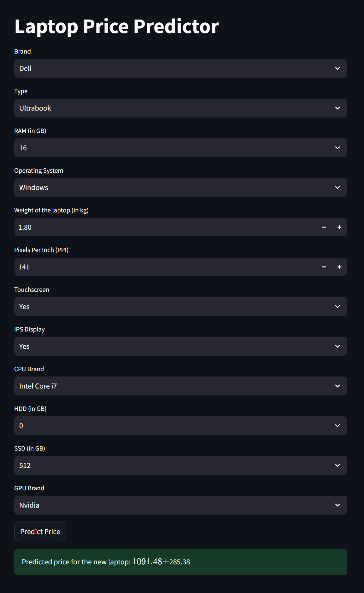

# Laptop Price Predictor



## Project Overview

Laptop Price Predictor is a machine learning project that estimates the price of a laptop based on its specifications. This project uses a Random Forest model trained on a dataset of laptop prices and features. The application provides a user-friendly web interface built with Streamlit, allowing users to input laptop specifications and receive a price prediction.

## Table of Contents

1. [Project Setup](#project-setup)
2. [Dataset](#dataset)
3. [Model Training](#model-training)
4. [Streamlit Application](#streamlit-application)
5. [Deployment Options](#deployment-options)
6. [File Structure](#file-structure)
7. [Usage](#usage)

## Project Setup

To set up this project, you'll need:

- Python 3.12.6 installed on your local machine
- Git for version control

Clone the repository:

```
git clone https://github.com/pouryare/laptop-price-predictor.git
cd laptop-price-predictor
```

Install the required packages:

```
pip install -r app/requirements.txt
```

## Dataset

The dataset used for this project is the "training_data.csv" file, which is included in the `app` folder of the repository. Please note that I am not the owner of this dataset; it was downloaded from the internet for educational purposes.

## Model Training

The model training process is detailed in the `laptop_price_predictor.ipynb` notebook. This notebook covers data preprocessing, exploratory data analysis, and model training using a Random Forest Regressor. The trained model is saved as `best_model_pipeline.joblib` in the `app` folder.

## Streamlit Application

The Streamlit application is defined in `app/app.py`. It provides a user interface for inputting laptop specifications and displays the predicted price.

## Deployment Options

There are three ways to use this application:

1. **Run Locally or on Google Colab**:
   - To run locally: `streamlit run app/app.py`
   - To run on Google Colab: Upload the notebook and follow the instructions within.

2. **Deploy on Heroku**:
   - Create a Heroku account and install the Heroku CLI.
   - Navigate to the `app` directory: `cd app`
   - Initialize a Git repository and commit your files.
   - Create a new Heroku app: `heroku create laptop-price-predictor`
   - Push your code to Heroku: `git push heroku master`

3. **Use Docker**:
   - Pull the Docker image: `docker pull pouryare/laptop-price-predictor`
   - Run the container: `docker run -p 8501:8501 pouryare/laptop-price-predictor`

## File Structure

```
laptop-price-predictor/
├── app/
│   ├── training_data.csv
│   ├── app.py
│   ├── best_model_pipeline.joblib
│   ├── Dockerfile
│   └── requirements.txt
│   └── Procfile
│   └── setup.sh
├── laptop_price_predictor.ipynb
├── README.md
└── screenshot.png
```

## Usage

1. Open the application (either locally, on Heroku, or via Docker).
2. Input the laptop specifications in the provided fields.
3. Click the "Predict Price" button.
4. View the predicted price and confidence interval.

---

This project demonstrates the application of machine learning in predicting laptop prices based on specifications. It serves as an excellent example of end-to-end machine learning project deployment with multiple hosting options.

For any issues or suggestions, please open an issue on the GitHub repository.

